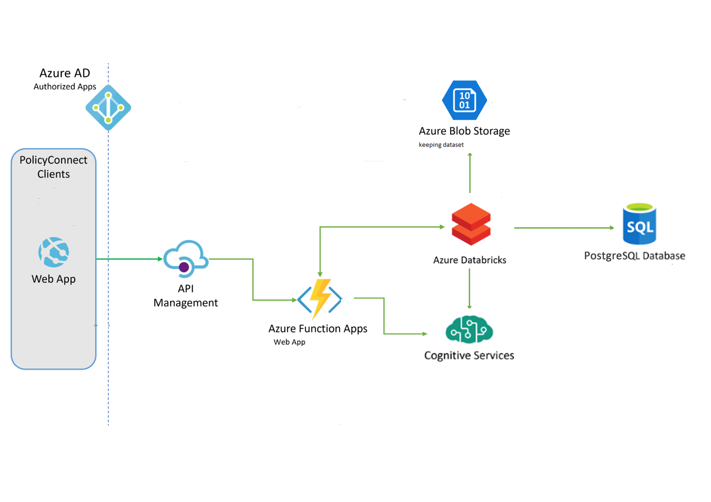

# Programowanie usług w chmurze

Projekt: rozpoznawanie wieku na podstawie zdjęcia

Autorzy:
*   Marcin Jurczak
*   Marek Knosala
*   Malwina Kubas
*   Magdalena Kuna
*   Paweł Niewęgłowski
*   Edward Sucharda

## Architektura aplikacji w Azure

Użytkownik loguje się na stronę poprzez Azure Active Directory za pomocą konta Microsoft lub Google. Na stronie można wgrać zdjęcie, które jest wysyłane przez API Management do Azure Function App. Tam zdjęcie jest poddawane obróbce, która polega na wycięciu fragmentu zdjęcia, w którym znajduje się twarz (i ewentualne zgłoszenie błedu, jeśli na zdjęciu nie ma człowieka). Wycięta twarz wysyłana jest do Azure Databricks Services, gdzie przekazywana jest na wejście modelu sieci neuronowej. Zwracanym wynikiem jest wiek osoby, który jest wyświetlany na stronie internetowej użytkownikowi, który to zdjęcie wysłał. Azure Blob Storage przechowuje cały dataset (chyba, że model nie będzie douczany), a baza PostgreeQSL DB przechowuje model sieci neuronowej.

Ewentualnym rozszerzeniem aplikacji będzie użycie Azure Cognitive Services (z Face API), które również będzie zwracało wiek osoby na zdjęciu, dzięki czemu będzie można porównywać wyniki.

## Diagram przypadków użycia

Jest to robocza wersja diagramu UML. Nie dodawałem administratora gdyż wykorzystywałby on dokładnie te same funkcjonalności co użytkownik. Jeżeli są jakieś sugestie, to piszcie i będę na bieżąco aktualizował diagram. 

## Model sieci neuronowej

Kod potrzebny do przetworzenia zdjęć, budowy i wytrenowania modelu sieci neuronowej znajduje
się w folderze NN_Model.

### Dataset

IMDb-Wiki dataset: https://data.vision.ee.ethz.ch/cvl/rrothe/imdb-wiki/

Dataset zawiera wiele źle wyskalowanych/wyciętych zdjęć, więc został użyty tylko podzbiór 
"Faces only". Znajduje się w nim 640 tys. zdjęć, część z nich jest zbyt niewyraźna lub błędnie
opisana (brak informacji lub wiek ujemny). Po modyfikacjach pozostało około 300 tys zdjęć.

### Model

Model sieci neuronowej składa się z warstw:
1. Warstwa konwolucyjna, głębia jądra: 32
2. Warstwa konwolucyjna, głębia jądra: 64
3. Warstwa konwolucyjna, głębia jądra: 128
4. Warstwa konwolucyjna, głębia jądra: 256
5. Warstwa spłaszczająca dane (Flatten)
6. Warstwa Dropout 20%
7. Warstwa 256 gęsto połączonych neuronów
8. Warstwa wyjściowa - 1 neuron, bez funkcji aktywacji

Wszystkie warstwy konwolucyjne mają rozmiar okna równy 3x3

Optymalizator: Adam, lr = 0.001

Innym sprawdzanym rozwiązaniem było użycie modelu InceptionV3 (załadowanie modelu z argumentem freeze=true, następnie dotrenowanie dwóch warstw gęsto połączonych. 

### Pliki

*  data_preparation:
   *   wypakowanie danych z pliku .mat (Matlab)
   *   usunięcie pustych zdjęć
   *   wycięcie twarzy ze zdjęć (klasyfikator HaarCascade z OpenCV) - funkcja Marcina
   *   ujednolicenie rozmiaru zdjęć
   *   obliczenie wieku osób na podstawie nazwy zdjęcia
   *   zapis danych do nowych plików csv

*  fix_csv - usunięcie wierszy, które:
   *   wskazywały na pliki, w których nie wykryto żadnej twarzy
   *   wiek był liczbą ujemną
   *   płeć nie była stwierdzona
   
*  model - model sieci neuronowej

*  inception_model - wytrenowanie modelu sieci korzystającego z modelu InceptionV3

*  test_new_photos - ocena zdjęć testowych

*  test_model - test sieci neuronowej 

*  test_inception - test sieci zawierającej model InceptionV3

## Wytrenowany model

Link do modelu: https://drive.google.com/drive/folders/1Dr8UX2PS-iZbj1CPeX1rJfHnYGnkejGI

Struktura sieci znajduje się w pliku JSON, a wagi w pliku h5.

### Colab

Notatnik w Colabie (pierwsza wersja kodu, niestety dataset był zbyt duży aby wytrenować model 
w Colabie):
https://colab.research.google.com/drive/1rPGtVji4odywJwv0ufEYi2BS-GPq7x-F?fbclid=IwAR32i5pVgd4cqhmMFU7KR-PjpRFOOyPKMrO7Oo8IVF1uD9cWK_oLN7XJ2As#scrollTo=ee0p1L0DpzXs

### Biblioteki

- TensorFlow 2.12.0
- Keras 2.3.1
- opencv-python 4.2.0
- NumPy 1.18.2
- Pandas 1.0.3
- matplotlib 3.2.1

## Zadania

TODO:

*  logowanie przez Azure AD - Marek
*  uruchamianie Azure Databricks w celu określenia wieku - Marcin

Zrobione:

*  przygotowanie danych uczących - Malwina
*  obróbka przesyłanych zdjęć (wycinanie twarzy, walidacja) - Marcin
*  wgrywanie plików ze zdjęciem na stronę - Marek
*  stworzenie modelu + wytrenowanie sieci neuronowej - Malwina
*  wyświetlanie przesłanych zdjęć na stronie - Marek
*  zapisywanie wyników w PostreSQL DB - Edward
*  obsłużenie Cognitive Services - Marcin
*  zwracanie wyniku na stronę internetową - Magda
*  zapisywanie zdjęć do Azure Blob Storage - Marek
*  utworzenie nowego AD, grupy zasobów i przypisanie uprawnień - Malwina
*  utworzenie strony internetowej - Marek
*  połączenie aplikacji w Function App - Magda
