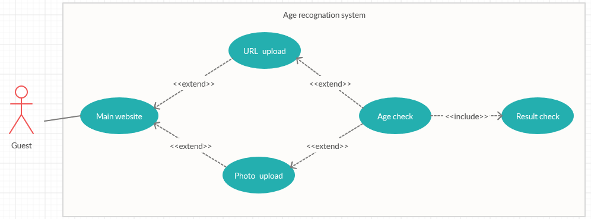

# Programowanie usług w chmurze

Projekt: rozpoznawanie wieku na podstawie zdjęcia

Autorzy:
*   Marcin Jurczak
*   Marek Knosala
*   Malwina Kubas
*   Magdalena Kuna
*   Edward Sucharda

## Architektura aplikacji w Azure

Użytkownik wchodzi na stronę internetową, gdzie można wgrać zdjęcie z komputera lub podać link do zdjęcia. Następnie przekazywane jest ono do Azure Function App. Tymczasowo zjęcie zapisywane jest do Azure Blob Storage by łatwiej na nim operować. Następnie zdjęcie jest przekazywane w dwa miejsca. Pierwszym z nich jest usułga Coginitive Servieces, gdzie na podsatwie wycinka zdjęcia z wykrytą twarzą wyznaczany jest wiek i zwracany do Function App. 
Drugie miejsce, do którego przekazywane jest zdjcie z Function App, to dockerowy kontener. Tam jest ładowany model, który został przez nas wcześniej wytrenowany. Zostają wycięte za pomocą funkcji z bibioteki OpenCV fragmenty zdjęcia zawierające twarz, które następnie zostają poddane analizie przez wcześniej wspomniany model. W kontenerze wywoływana jest również funkcja zapisująca zdjęcie wraz z oszacowanym wynikiem do Azure SQL Database. Na koniec program umieszczony w kontenerze zwraca wiek do Function App. Na sam koniec Function App zwraca otrzymane wyniki do Web App'a. Dzięki temu na stronie internetowej pojawiają się dwa wyniki: wyliczony za pomocą Cognitive Servieces oraz wyliczony przez stworzoną przez nas sieć.
Gdy na przesyłanym zdjęciu znajdują się dwie lub więcej osób obie metody szacujące wiek są tak zaprojektowane by zwracać wektor wyliczonego wieku osób na zdjęciu. W takiej sytuacji na stronie internetowej pojawi się kilka wyników odzielonych przecinkiem.
Dzięki zapisanym zdjęciom w Azure SQL Database istnieje w przyszłości możliwość dotrenowania modelu na podstawie nowych zdjęć oraz sprawdzania poprawności obliczanych wyników przez naszą sieć na podstawie zdjęć udostępnianych przez użytkowników.

## Diagram przypadków użycia

Jest to aktualna wersja diagramu UML. Istnieje możlwiość rozbudowy diagramu o nowe funkcjonalności takie jak logowanie do systemu, głosowanie dotyczące trafności przewidywania czy przeglądanie historii analizowanych zdjęć. 

## Playlista

https://www.youtube.com/playlist?list=PLCpsFIg2cqnjOLTCMcnG9uikYz1YYkgjl

## Model sieci neuronowej

Kod potrzebny do przetworzenia zdjęć, budowy i wytrenowania modelu sieci neuronowej znajduje
się w folderze NN_Model.

### Dataset

IMDb-Wiki dataset: https://data.vision.ee.ethz.ch/cvl/rrothe/imdb-wiki/

Dataset zawiera wiele źle wyskalowanych/wyciętych zdjęć, więc został użyty tylko podzbiór 
"Faces only". Znajduje się w nim 640 tys. zdjęć, część z nich jest zbyt niewyraźna lub błędnie
opisana (brak informacji lub wiek ujemny). Po modyfikacjach pozostało około 300 tys zdjęć.

### Model

Model sieci neuronowej składa się z warstw:
1. Warstwa konwolucyjna, głębia jądra: 32
2. Warstwa konwolucyjna, głębia jądra: 64
3. Warstwa konwolucyjna, głębia jądra: 128
4. Warstwa konwolucyjna, głębia jądra: 256
5. Warstwa spłaszczająca dane (Flatten)
6. Warstwa Dropout 20%
7. Warstwa 256 gęsto połączonych neuronów
8. Warstwa wyjściowa - 1 neuron, bez funkcji aktywacji

Wszystkie warstwy konwolucyjne mają rozmiar okna równy 3x3

Optymalizator: Adam, lr = 0.001

Innym sprawdzanym rozwiązaniem było użycie modelu InceptionV3 (załadowanie modelu z argumentem freeze=true, następnie dotrenowanie dwóch warstw gęsto połączonych. 

### Pliki

*  data_preparation:
   *   wypakowanie danych z pliku .mat (Matlab)
   *   usunięcie pustych zdjęć
   *   wycięcie twarzy ze zdjęć (klasyfikator HaarCascade z OpenCV) - funkcja Marcina
   *   ujednolicenie rozmiaru zdjęć
   *   obliczenie wieku osób na podstawie nazwy zdjęcia
   *   zapis danych do nowych plików csv

*  fix_csv - usunięcie wierszy, które:
   *   wskazywały na pliki, w których nie wykryto żadnej twarzy
   *   wiek był liczbą ujemną
   *   płeć nie była stwierdzona
   
*  model - model sieci neuronowej

*  inception_model - wytrenowanie modelu sieci korzystającego z modelu InceptionV3

*  test_new_photos - ocena zdjęć testowych

*  test_model - test sieci neuronowej 

*  test_inception - test sieci zawierającej model InceptionV3

### Wytrenowany model

Link do modelu: https://drive.google.com/drive/folders/1Dr8UX2PS-iZbj1CPeX1rJfHnYGnkejGI

Struktura sieci znajduje się w pliku JSON, a wagi w pliku h5. Model należy umieści w konterze razem z zawartoscią folderu DockerInstance.

### Cognitive Services

Do rozpoznawania wieku z wykorzystaniem narzędzi platformy Azure wykorzystano Face Cognitive Service w bezpłatnej wersji umożliwiającej do 30k wywołań miesięcznie. Więcej informacji na temat samego serwisu Face oraz jego możliwości można znaleźć w [dokumentacji](https://docs.microsoft.com/en-us/azure/cognitive-services/face/overview).

## Kontener

Wszystkie pliki użyte do wyliczania wieku znajdujące się w kontenerze zostały umieszczone w folderze DockerInstance.

### Colab

Notatnik w Colabie (pierwsza wersja kodu, niestety dataset był zbyt duży aby wytrenować model 
w Colabie):
https://colab.research.google.com/drive/1rPGtVji4odywJwv0ufEYi2BS-GPq7x-F?fbclid=IwAR32i5pVgd4cqhmMFU7KR-PjpRFOOyPKMrO7Oo8IVF1uD9cWK_oLN7XJ2As#scrollTo=ee0p1L0DpzXs

### Biblioteki

- TensorFlow 2.12.0
- Keras 2.3.1
- opencv-python 4.2.0
- NumPy 1.18.2
- Pandas 1.0.3
- matplotlib 3.2.1

## Template grupy zasobów

znajduje się w pliku ExportedTemplate-Projekt_Chmury.zip

## Zadania

Zrobione:

*  przygotowanie danych uczących - Malwina
*  obróbka przesyłanych zdjęć (wycinanie twarzy, walidacja) - Marcin
*  wgrywanie plików ze zdjęciem na stronę - Marek
*  stworzenie modelu + wytrenowanie sieci neuronowej - Malwina
*  wyświetlanie przesłanych zdjęć na stronie - Marek
*  zapisywanie wyników w Azure SQL Database - Edward
*  obsłużenie Cognitive Services - Marcin
*  zwracanie wyniku na stronę internetową - Magda
*  zapisywanie zdjęć do Azure Blob Storage - Marek
*  utworzenie nowego AD, grupy zasobów i przypisanie uprawnień - Malwina
*  utworzenie strony internetowej - Marek
*  połączenie aplikacji w Function App - Magda
*  logowanie przez Azure AD - Marek
*  uruchamianie Azure Databricks (lub innego serwisu) w celu określenia wieku - Edward + Magda
